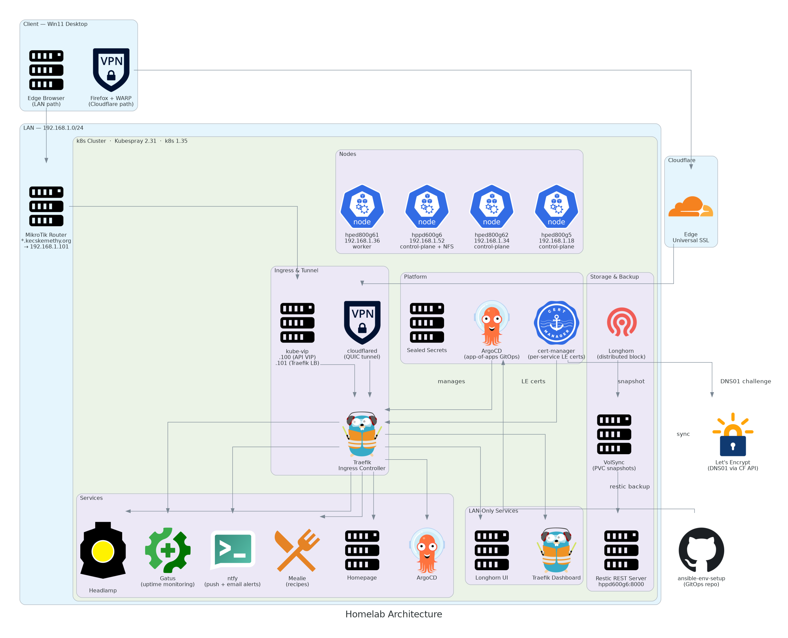

# GitOps Architecture — <your-domain.tld> Homelab

This document describes the architecture for managing both Kubernetes clusters
using Ansible for infrastructure bootstrapping and ArgoCD for continuous GitOps delivery.



---

## Clusters

| Cluster | Purpose | Nodes | Version |
|---------|---------|-------|---------|
| **homelab** | Bare-metal HA cluster | 3 control-plane + 1 worker | k8s v1.35.4 (Kubespray release-2.31) |
| **local** | Local dev / experimentation | 1 node (WSL2) | k3s v1.34.6 |

Both clusters follow the same component model to keep configuration and skills transferable.

---

## Two-Layer Model

```
┌─────────────────────────────────────────────────────────────┐
│  Layer 1 — Infrastructure (this repo: ansible-env-setup)    │
│                                                             │
│  post-k8s.yml → Longhorn prereqs, kube-extra tools,         │
│                 ArgoCD app-of-apps bootstrap                 │
│                                                             │
│  post-k3s.yml → ArgoCD (Helm)                              │
│               → app-of-apps bootstrap (kubectl apply)       │
│                 ArgoCD then installs all apps from           │
│                 kube-gitops/                                 │
│                                                             │
│  Re-run only for: cluster rebuilds, node changes            │
└──────────────────────────────┬──────────────────────────────┘
                               │ ArgoCD watches GitOps repo
┌──────────────────────────────▼──────────────────────────────┐
│  Layer 2 — GitOps (kube-gitops/ in this repo)               │
│                                                             │
│  kube-gitops/k8s/    kube-gitops/k3s/                       │
│    → root.yaml         → root.yaml   (bootstrap App)        │
│    → apps/             → apps/       (child Applications)   │
│    → values/           → values/     (Helm values per app)  │
│                                                             │
│  ArgoCD self-manages after initial bootstrap                │
└─────────────────────────────────────────────────────────────┘
```

**Principle:** Ansible owns the platform layer (install once, rarely touch).
ArgoCD owns everything running on top (continuous reconciliation).

---

## Component Inventory

### Homelab (bare-metal, KUBECONFIG=~/.kube/k8s.yaml)

| Component | Installed by | Managed by |
|-----------|-------------|------------|
| Kubernetes v1.35.4 | Kubespray (`k8s.yml`) | Kubespray |
| kube-vip v0.8.9 | Kubespray | Kubespray |
| Cilium CNI | Kubespray | Kubespray |
| cert-manager v1.15.3 | Kubespray addon | — (Kubespray raw manifests) |
| ArgoCD v2.14.5 | Kubespray addon | ArgoCD (self-manages) |
| Traefik | Ansible bootstrap + ArgoCD | ArgoCD |
| Sealed Secrets | Ansible bootstrap + ArgoCD | ArgoCD |
| Headlamp | Ansible bootstrap + ArgoCD | ArgoCD |
| Longhorn | Ansible (iSCSI prereqs) + ArgoCD | ArgoCD |
| cloudflared | ArgoCD | ArgoCD |
| external-dns | ArgoCD | ArgoCD |
| Reloader | ArgoCD | ArgoCD |

### Local k3s (KUBECONFIG=~/.kube/k3s.yaml)

| Component | Installed by | Managed by |
|-----------|-------------|------------|
| k3s v1.34.6 | Ansible (`k3s.yml`) | Ansible |
| ArgoCD v2.13.1 | Ansible (`post-k3s.yml`) | ArgoCD (self-manages) |
| Traefik | ArgoCD (`kube-gitops/k3s/apps/`) | ArgoCD |
| Sealed Secrets | ArgoCD (`kube-gitops/k3s/apps/`) | ArgoCD |
| Headlamp | ArgoCD (`kube-gitops/k3s/apps/`) | ArgoCD |
| cert-manager | ArgoCD (`kube-gitops/k3s/apps/`) | ArgoCD |

> k3s ships Traefik built-in. It is disabled at install time (`k3s_disable_traefik: true`)
> so the ArgoCD-managed instance is the only one running.

---

## App Comparison — k3s vs k8s

| App | k3s | k8s | Notes |
|-----|-----|-----|-------|
| traefik | ✅ | ✅ | k3s: hostNetwork+ClusterIP (WSL2); k8s: LoadBalancer .101 |
| cert-manager | ✅ | ✅ | DNS-01 via Cloudflare on both |
| cert-manager-config | ✅ | ✅ | Separate SealedSecret per cluster |
| sealed-secrets | ✅ | ✅ | Each cluster has its own key |
| headlamp | ✅ | ✅ | |
| homepage | ✅ | ✅ | Different values per cluster |
| ingressroutes | ✅ | ✅ | k3s: `*.k3s.<your-domain.tld>`; k8s: `*.<your-domain.tld>` |
| reloader | ✅ | ✅ | |
| cloudflared | ❌ | ✅ | k3s is LAN-only, no internet exposure needed |
| external-dns | ❌ | ✅ | No Cloudflare tunnel on k3s, no public DNS records needed |
| longhorn | ❌ | ✅ | Single-node k3s uses local-path provisioner instead |
| argocd | bootstrap only | bootstrap only | Installed via Ansible, not self-managed by ArgoCD |

---

## DNS and Domain Structure

| Cluster | Base domain | Wildcard cert covers |
|---------|-------------|---------------------|
| Homelab | `<your-domain.tld>` | `*.<your-domain.tld>` |
| k3s local | `k3s.<your-domain.tld>` | `*.k3s.<your-domain.tld>` |

### Split-horizon DNS

Traffic reaches the correct endpoint depending on the client's location:

| Client | DNS resolver used | Resolves to | Path |
|--------|------------------|-------------|------|
| LAN (DoH off) | Router (`192.168.1.1`) | `192.168.1.101` | Direct to Traefik |
| Internet | Cloudflare public DNS | Cloudflare proxy IPs | Via Cloudflare Tunnel |

**Router DNS:** one wildcard entry covers all services automatically:
```
*.<your-domain.tld>  →  192.168.1.101   (Traefik LoadBalancer)
```

**Cloudflare DNS:** per-service CNAME records managed automatically by external-dns:
```
CNAME  argocd.<your-domain.tld>    →  9fa18953-8d82-424d-a8b5-9941940d4230.cfargotunnel.com  (proxied)
CNAME  headlamp.<your-domain.tld>  →  9fa18953-8d82-424d-a8b5-9941940d4230.cfargotunnel.com  (proxied)
CNAME  longhorn.<your-domain.tld>  →  9fa18953-8d82-424d-a8b5-9941940d4230.cfargotunnel.com  (proxied)
```

New services only need an IngressRoute with the tunnel annotation — external-dns creates
the Cloudflare record automatically within ~1 minute.

**Windows/Firefox note:** disable DNS over HTTPS (DoH) in Firefox so the browser uses
system DNS → router wildcard. With DoH enabled, Firefox bypasses the router and hits
Cloudflare's edge, which can cause QUIC/HTTP3 caching issues on LAN.

---

## Adding a New Service

1. Add an ArgoCD Application to `kube-gitops/k8s/apps/`
2. Add Helm values to `kube-gitops/k8s/values/` if needed
3. Add an IngressRoute to `kube-gitops/k8s/ingressroutes/` with the tunnel annotation:

```yaml
metadata:
  annotations:
    external-dns.alpha.kubernetes.io/target: "9fa18953-8d82-424d-a8b5-9941940d4230.cfargotunnel.com"
spec:
  entryPoints: [websecure]
  routes:
    - match: Host(`myapp.<your-domain.tld>`)
      services:
        - name: myapp
          port: 80
  tls: {}
```

4. Commit and push → ArgoCD syncs the app, external-dns creates the DNS record.
   No other DNS or certificate config needed.

---

## SSL — Automated Certificate Renewal

cert-manager handles all certificate lifecycle. No manual cert management.

### Challenge type: DNS-01 via Cloudflare

HTTP-01 is not viable (clusters are LAN-only, not reachable from the internet).
DNS-01 proves domain ownership by creating a TXT record in Cloudflare via API token.

```
cert-manager  →  Cloudflare API (DNS-01 challenge)  →  Let's Encrypt
     ↓
Wildcard cert: *.<your-domain.tld>  (homelab)
               *.k3s.<your-domain.tld>  (local k3s)
     ↓
Secret in traefik namespace → TLSStore default → all IngressRoutes get it automatically
```

### Cloudflare API token (scoped minimally)

```
Zone → Zone → Read
Zone → DNS  → Edit
Scope: <your-domain.tld> only
```

Stored as a **Sealed Secret** per cluster — encrypted with each cluster's public key,
safe to commit to git. The same raw token needs to be sealed separately for each cluster
because Sealed Secrets are cluster-specific.

---

## Secrets Management — Sealed Secrets

[Sealed Secrets](https://github.com/bitnami-labs/sealed-secrets):
- Controller runs in-cluster (holds the private key)
- `kubeseal` CLI encrypts secrets with the cluster's public key on the workstation

### Workflow

```bash
# 1. Encrypt the secret (safe to commit)
kubectl create secret generic my-secret \
  --from-literal=key=value \
  --dry-run=client -o yaml | \
  kubeseal --kubeconfig ~/.kube/k8s.yaml \
  --controller-name sealed-secrets \
  --controller-namespace sealed-secrets \
  --namespace target-namespace \
  --name my-secret \
  -o yaml > kube-gitops/k8s/myapp/my-secret-sealed.yaml

# 2. Commit — the controller decrypts in-cluster, plaintext never leaves the machine
```

**Important:** sealed secrets are cluster-specific. The k8s and k3s clusters each need
their own sealed version of any shared secret (e.g. Cloudflare API token).

---

## Traffic Flow

### Internet request (homelab, via Cloudflare Tunnel)

```
Browser: https://argocd.<your-domain.tld>
         │
         ▼
Cloudflare edge  (CNAME → <tunnel-id>.cfargotunnel.com, proxied)
         │  outbound tunnel (cloudflared initiates, no open ports needed)
         ▼
cloudflared pod  (namespace: cloudflared)
         │  https://traefik.traefik.svc.cluster.local  (noTLSVerify: true)
         ▼
Traefik: TLS termination (wildcard cert *.<your-domain.tld> from cert-manager)
         Host: argocd.<your-domain.tld> → argocd-server:80 (ClusterIP)
         │
         ▼
ArgoCD pod
```

### LAN request (homelab, direct)

```
Browser: https://argocd.<your-domain.tld>
         │
         ▼
Router DNS wildcard: *.<your-domain.tld> → 192.168.1.101
         │
         ▼
kube-vip ARP: 192.168.1.101 → Traefik pod (LoadBalancer service)
         │
         ▼
Traefik → ArgoCD pod  (same path from here)
```

### kube-vip + Traefik

| Layer | Tool | Responsibility |
|-------|------|---------------|
| L4 — IP announcement | kube-vip | ARP-announces 192.168.1.101 on LAN |
| L7 — HTTP routing + TLS | Traefik | Routes by hostname, terminates SSL |

---

## IP Plan (Homelab)

| IP | Role |
|----|------|
| 192.168.1.100 | kube-vip API VIP |
| 192.168.1.101 | Traefik LoadBalancer |
| 192.168.1.102 | Free |

---

## GitOps Directory Structure

```
kube-gitops/
├── k8s/                            # Bare-metal homelab cluster
│   ├── root.yaml                   # Bootstrap Application — applied once by Ansible
│   ├── apps/                       # ArgoCD watches this directory (app-of-apps)
│   │   ├── traefik.yaml
│   │   ├── sealed-secrets.yaml
│   │   ├── headlamp.yaml
│   │   ├── homepage.yaml
│   │   ├── longhorn.yaml
│   │   ├── cert-manager-config.yaml
│   │   ├── ingressroutes.yaml
│   │   ├── cloudflared.yaml
│   │   ├── external-dns.yaml
│   │   ├── external-dns-config.yaml
│   │   └── reloader.yaml
│   ├── values/                     # Helm values per app
│   │   ├── traefik.yaml
│   │   ├── sealed-secrets.yaml
│   │   ├── headlamp.yaml
│   │   ├── longhorn.yaml
│   │   └── external-dns.yaml
│   ├── cert-manager/               # ClusterIssuer + Certificate + SealedSecret
│   ├── cloudflared/                # Tunnel deployment + config + SealedSecret
│   ├── external-dns/               # SealedSecret (Cloudflare token)
│   └── ingressroutes/              # IngressRoute + TLSStore per service
│       ├── tlsstore.yaml
│       ├── argocd.yaml
│       ├── headlamp.yaml
│       └── longhorn.yaml
└── k3s/                            # Local dev cluster
    ├── root.yaml
    ├── apps/                       # traefik, sealed-secrets, headlamp, homepage,
    │                               # cert-manager, cert-manager-config, reloader
    ├── values/
    ├── cert-manager/
    └── ingressroutes/              # argocd, headlamp, homepage, traefik-dashboard, tlsstore
```

To add a new service: add files to `apps/`, `values/`, and `ingressroutes/` → commit → ArgoCD applies automatically.

---

## Dependency Updates — Renovate

[Renovate](https://github.com/renovatebot/renovate) runs as a GitHub App and automatically
opens PRs when Helm chart versions are updated:

- **Helm charts** (`targetRevision` in ArgoCD Application YAMLs) — grouped PR, manual review
- **GitHub Actions** — grouped PR, automerged
- **Python dependencies** (`requirements*.txt`) — grouped PR, manual review

Config: `renovate.json` at repo root.

---

## Decisions Made

| Decision | Choice | Reason |
|----------|--------|--------|
| Ingress controller | Traefik | k3s-native, CRD-based IngressRoutes, active maintenance |
| Secrets | Sealed Secrets | Simple, no external dependency, safe to commit |
| SSL challenge | Cloudflare DNS-01 | Clusters are LAN-only; HTTP-01 requires public access |
| Cert scope | Wildcard per cluster | One cert covers all services automatically via TLSStore |
| External access | Cloudflare Tunnel | No open ports, home IP hidden, outbound-only |
| DNS automation | external-dns (traefik-proxy source) | Auto-creates Cloudflare records from IngressRoute annotations |
| LAN DNS | Router wildcard `*.<your-domain.tld>` | One entry covers all future services, no per-service config |
| GitOps location | `kube-gitops/` in this repo | Solo homelab: one repo is simpler |
| ArgoCD bootstrap | Ansible applies root app once | Clean handoff: Ansible bootstraps, ArgoCD self-manages after |
| Dependency updates | Renovate (GitHub App) | Handles Helm charts which Dependabot cannot |
